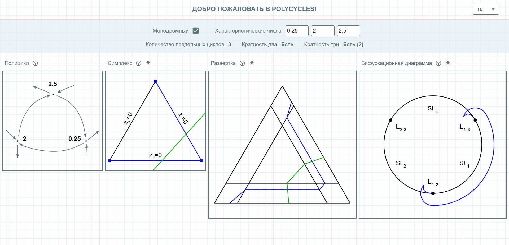

<h1>
&nbsp;
Полициклы
</h1>

Демо версия приложения по [ссылке](https://chichivika.github.io/polycycles/).

## Описание

Проект представляет собой одностраничное десктопное веб-приложение, отображающее бифуркацию гиперболических полициклов из трёх сепаратрисных связок --- монодромного и немонодромного. В основе модели лежит теория развёртки бифуркационных диаграмм, превращающая бифуркационную диаграмму в симплекс на проективном пространстве.

## Использование

Пользователю предоставляется изменять четыре параметра: три характеристических числа, соответствующих сёдлам полицикла, и флаг монодромности полицикла. По данным параметрам строятся четыре картинки: полицикл, симплекс, развёртка и бифуркационная диаграмма.

    

Характеристическое число седла может быть любым действительным положительным числом. Для ввода числа пользователь использует текстовое поле. После ввода числа обновление картинок происходит при нажатии на клавишу Enter, либо при потере фокуса. При фокусировке на текстовом поле и нажатии клавиш клавиатуры "вверх/вниз" введенное число увеличивается/уменьшается на 0.1 и сразу же происходит обновление картинок.

Флаг монодромности полицикла можно установить или снять при помощи инструмента checkbox. Обновление картинок происходит сразу после изменения флага.

Можно скачать построенные картинки, нажав на соответствующую иконку над изображением.

## Разработка

Проект был собран при помощи [Create React App](https://github.com/facebook/create-react-app).
